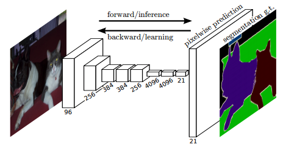

# Semantic Segmentation

Label the pixels of a road in images using a Fully Convolutional Network (FCN).

## Fully Convolutional Networks for Semantic Segmentation

[Paper Link From Berkeley](https://people.eecs.berkeley.edu/~jonlong/long_shelhamer_fcn.pdf)

Semantic segmentation is the task of assigning meaning of part of an object. this can
be done at the pixel level where we assign each pixel to a target class such as road,
car, pedestrian, sign or any number of other classes.

Which Fully convolutional networks can efficiently learn to make dense predictions.


Each layer of data in a convnet is a three-dimensional
array of size h × w × d, where h and w are spatial dimensions,
and d is the feature or channel dimension. The first
layer is the image, with pixel size h × w, and d color channels.


Transforming fully connected layers into convolution
layers enables a classification net to output a heatmap. Adding
layers and a spatial loss (as in Figure 1) produces an efficient machine
for end-to-end dense learning.

### Knowing What and Where


## Implementation in this Project

### Overall Architecture

Image From: [http://cvlab.postech.ac.kr/research/deconvnet](http://cvlab.postech.ac.kr/research/deconvnet/)

### Setup
##### GPU

GPU is necessary for this project.

##### Frameworks and Packages
Make sure you have the following is installed:
 - [Python 3](https://www.python.org/)
 - [TensorFlow >= 1.0](https://www.tensorflow.org/)
 - [NumPy](http://www.numpy.org/)
 - [SciPy](https://www.scipy.org/)
 
##### Dataset
Download the [Kitti Road dataset](http://www.cvlibs.net/datasets/kitti/eval_road.php) from [here](http://www.cvlibs.net/download.php?file=data_road.zip).  Extract the dataset in the `data` folder.  This will create the folder `data_road` with all the training a test images.

## Transfer Learning from [VGG16](https://arxiv.org/abs/1409.1556)

##### Download VGG16 pretrained model
Code will download vgg16 pretraned model under data folder. 

##### Loading Model


##### Implement
Implement the code in the `main.py` module indicated by the "TODO" comments.
The comments indicated with "OPTIONAL" tag are not required to complete.
##### Run
Run the following command to run the project:
```
python main.py
```
**Note** If running this in Jupyter Notebook system messages, such as those regarding test status, may appear in the terminal rather than the notebook.

### Submission
1. Ensure you've passed all the unit tests.
2. Ensure you pass all points on [the rubric](https://review.udacity.com/#!/rubrics/989/view).
3. Submit the following in a zip file.
 - `helper.py`
 - `main.py`
 - `project_tests.py`
 - Newest inference images from `runs` folder  (**all images from the most recent run**)
 
 ### Tips
- The link for the frozen `VGG16` model is hardcoded into `helper.py`.  The model can be found [here](https://s3-us-west-1.amazonaws.com/udacity-selfdrivingcar/vgg.zip).
- The model is not vanilla `VGG16`, but a fully convolutional version, which already contains the 1x1 convolutions to replace the fully connected layers. Please see this [post](https://s3-us-west-1.amazonaws.com/udacity-selfdrivingcar/forum_archive/Semantic_Segmentation_advice.pdf) for more information.  A summary of additional points, follow. 
- The original FCN-8s was trained in stages. The authors later uploaded a version that was trained all at once to their GitHub repo.  The version in the GitHub repo has one important difference: The outputs of pooling layers 3 and 4 are scaled before they are fed into the 1x1 convolutions.  As a result, some students have found that the model learns much better with the scaling layers included. The model may not converge substantially faster, but may reach a higher IoU and accuracy. 
- When adding l2-regularization, setting a regularizer in the arguments of the `tf.layers` is not enough. Regularization loss terms must be manually added to your loss function. otherwise regularization is not implemented.
 
### Using GitHub and Creating Effective READMEs
If you are unfamiliar with GitHub , Udacity has a brief [GitHub tutorial](http://blog.udacity.com/2015/06/a-beginners-git-github-tutorial.html) to get you started. Udacity also provides a more detailed free [course on git and GitHub](https://www.udacity.com/course/how-to-use-git-and-github--ud775).

To learn about REAMDE files and Markdown, Udacity provides a free [course on READMEs](https://www.udacity.com/courses/ud777), as well. 

GitHub also provides a [tutorial](https://guides.github.com/features/mastering-markdown/) about creating Markdown files.
